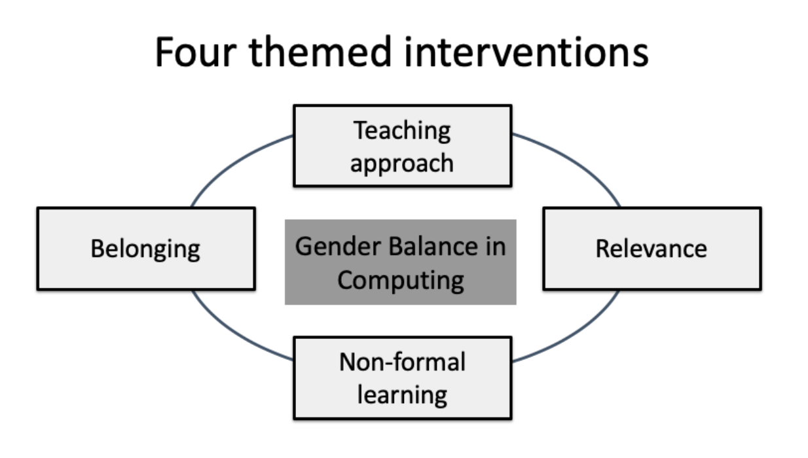
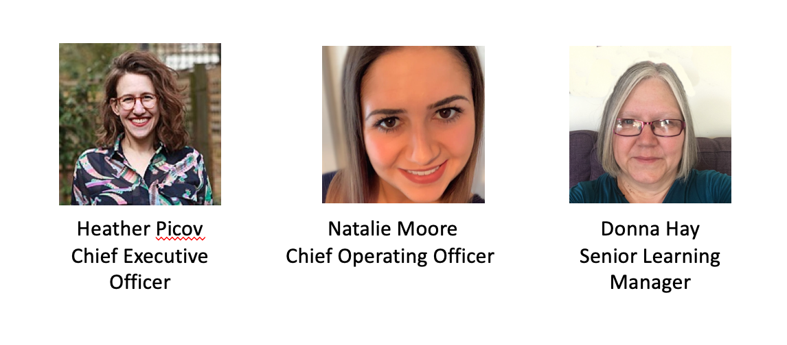
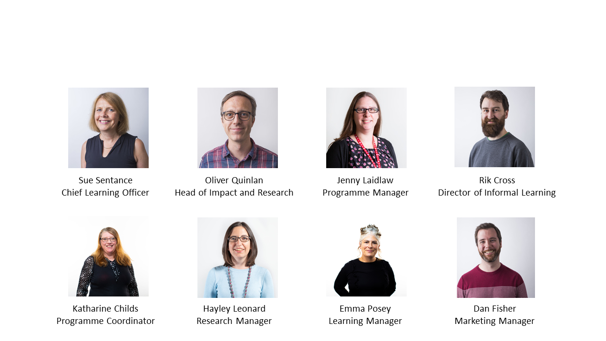

## The Gender Balance in Computing (GBIC) programme

Gender Balance in Computing (GBIC) is a new programme of research to investigate how we can better engage girls in computing and increase the number of girls selecting computer science at GCSE and A level.

It is part of the National Centre for Computing Education (NCCE), which is delivered by a consortium of organisations including the Raspberry Pi Foundation, STEM Learning, and BCS, The Chartered Institute for IT. It is funded by the Department for Education to support computing in schools in England.

The NCCE's vision is for every child in every school in England to have a world-leading computing education. We provide high-quality support for the teaching of computing in schools and colleges, from key stage 1 through to A level. Our extensive range of training, resources, and support covers elements of the curriculum at every key stage, catering for all levels of subject knowledge and experience.

{:width="400px"}

The Gender Balance in Computing programme of research is the largest national research effort to tackle gender balance in computing to date. Trials began in 2019 and will run to 2022 in key stages 1 to 4. By the end of 2022, more than 15,000 students and 550 schools will be involved in the programme.

The research is made up of several randomised control trials. Each trial investigates a different intervention that previous research has identified as beneficial to girls' engagement with computing, or with science, technology, engineering, and maths more generally. We have recruited schools for each trial and randomly assigned them into two groups: one group will continue with 'business as usual' and the other will complete the new intervention. Our evaluation partners from the Behavioural Insights Team will collect data about both groups before and after the trial to compare the impact that it has had. This is the best way we know of to understand the impact of new practices in education, and it is the approach that is used in education research across the world. 

The trials focus on:
+ Informal learning (Year 6 in Code Clubs and Year 8 completing the Apps for Good programme): the intervention highlights the links between what pupils learn in informal computing settings and more formal computing education
+ Belonging (Year 5): the intervention targets pupils' sense of belonging in computing by increasing parent understanding of computing education and careers, and introducing role models
+ Teaching approach (Years 2, 4, 6, and 8): the intervention focuses on approaches to teaching computing that may engage more girls in computing
+ Relevance (Year 8): the intervention focuses on using computing and technology to solve real-world problems

You are taking part in the Relevance trial, in which we are evaluating whether relating learning to addressing real-world problems successfully engages more girls in computing. The trial will include students in Year 8.

The trial is being implemented by the Raspberry Pi Foundation, and you can contact us throughout the trial if you have any queries. The evaluation of the trial is being conducted by the Behavioural Insights Team, and they will contact you during the trial to collect data. More information about all of the processes and points of contact will be provided throughout the training course.

**The Relevance team**
For the Relevance trial, the Raspberry Pi Foundation is working in partnership with [Apps for Good](https://www.appsforgood.org){:target="_blank"}, who have developed and produced all the teaching resources for this trial. The recruitment and online training is provided by the Raspberry Pi Foundation.

**The GBIC team at Apps for Good**
The Apps for Good team is responsible for the teaching resources. Programme management and implementation is led by Heather Picov and Natalie Moore. The teaching resources for the trial have been created by Donna Hay.

{:width="500px"}

**The GBIC team at the Raspberry Pi Foundation**
The Raspberry Pi Foundation is recruiting for all of the trials, and you will receive communications about your participation from Katharine Childs. Katharine is your main point of contact for any questions you may have about the trial and you can contact her at [genderresearch@raspberrypi.org](mailto:genderresearch@raspberrypi.org). Hayley Leonard is responsible for the day-to-day management of the trial, with programme management and implementation led by Sue Sentance, Oliver Quinlan, and Jenny Laidlaw. The online training resources for the trial have been created by Emma Posey, who works on educational resources across the Raspberry Pi Foundation.

--- task ---

**Pause and reflect**
What are your experiences of gender balance in computing in your classroom? Do you find that there is a difference in boys' and girls' engagement with computing or their attitudes towards it?

--- /task ---

Click the green button (below right) to go to the next step in Part 1.

You can go back to the [start of Part 1 here](https://projects.raspberrypi.org/en/projects/Year8-RelevanceTraining-Part1-GBICi4).
You can access the [menu for Parts 1, 2, and 3 here](https://projects.raspberrypi.org/en/pathways/year8-relevancetraining-gbici4).
