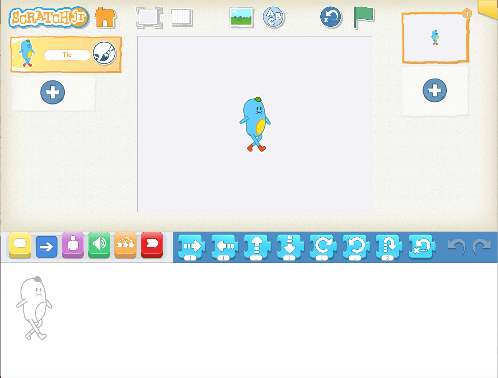

##  The 'Storytelling' approach
There is evidence that gender stereotypes develop early, but little evidence on interventions that target this early development of stereotypes, and none that relate specifically to computing. This pilot intervention focuses on pupils in key stage 1 and builds on evidence that teaching computing through storytelling and story-writing is effective with 11- to 14-year-olds. The trial investigates whether this is also effective for pupils in key stage 1 (5- to 7-year-olds). This pilot will be evaluated, and the results will be used to determine whether the intervention will proceed to a full-scale trial.

In the trial, you will use the 'Storytelling' teaching approach, which aims to use narrative to teach computing. Story-writing and digital storytelling are used to introduce computing topics to children when, for instance, teachers use game-based computing activities. Teachers are provided with resources that centre on teaching pupils computing through programming stories.

During the 'Storytelling' project, pupils learn to program in [ScratchJr](https://www.scratchjr.org), an age-appropriate programming tool. ScratchJr uses a format that is more similar to writing a story than in the Scratch programming language. As you can see in the picture below, you drag and drop blocks into a horizontal 'storyline' in ScratchJr, so the relationship with reading or writing a story in literacy is clear.

{:width="400px"}

This is different to the way in which the user stacks code in a vertical format in Scratch, which is closer to text-based programming than storytelling.

{:width="400px"}

The 'Storytelling' teaching approach introduces the fundamental computing concepts of sequence, repetition, and selection. The trial focuses on two strands of storytelling:
story-writing (structure) and digital storytelling (this includes using animation, graphics, and audio to tell a story).

**Story-writing** is a means of exploring computer programming. Pupils use these skills to:
+ Construct a story
+ Organise code around programming constructs
+ Create sequence (an algorithm such as beginning/middle/end)
+ Use repetition (iteration)
+ Use selection
+ Introduce input and output processes through the use of characters
+ Solve problems as the program develops

**Digital storytelling** is used as a brief for creating programs. Pupils' programs are converted into digital artefacts through the use of images, text, and motion for interactive animations. Digital storytelling requires pupils to be innovative and structure their ideas around a narrative.

Click the green button (below right) to go to the next step in this session.

You can go back to the [list of contents for this session (Session 1) here](https://projects.raspberrypi.org/en/projects/KS1StorytellingTraining_Session1_GBICi1b).
You can access the [menu for Sessions 1, 2, and 3 here](https://projects.raspberrypi.org/en/pathways/ks1-storytellingtraining-gbici1b).
