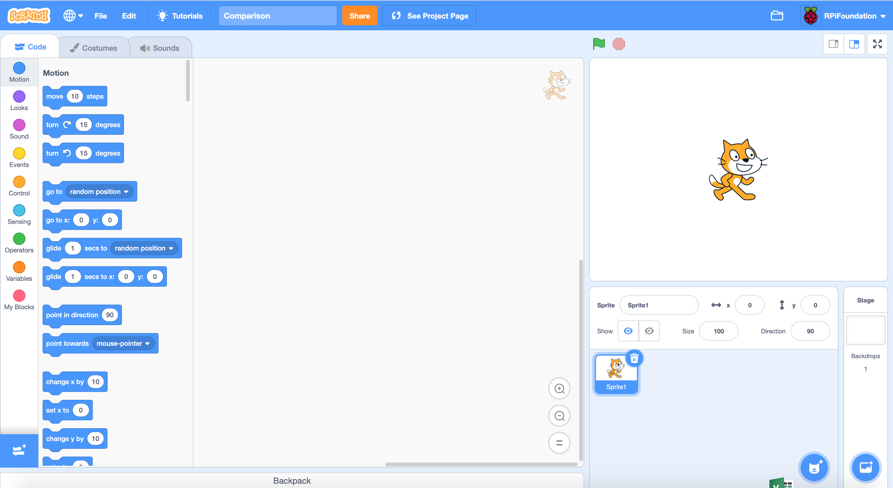
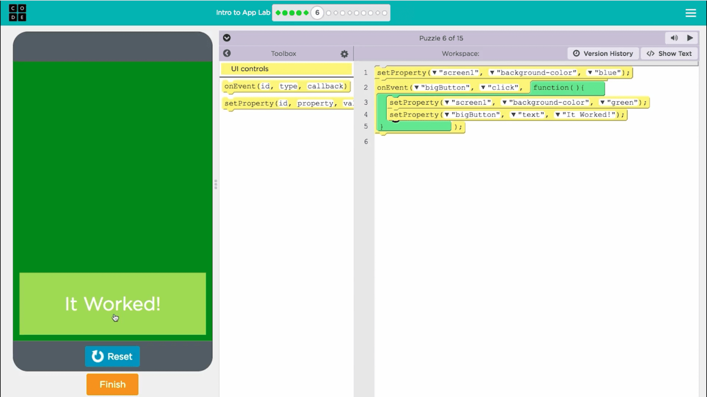

##  The Relevance trial in practice
This intervention focuses on students in Year 8 and builds on evidence that linking learning to everyday life can increase student engagement.

In the Relevance trial, you will support students to identify real-world problems and produce an app that can address a problem that matters to them. This will help students to develop a number of technical skills within a more practical context, which will help to link computing to everyday life.

The Relevance trial focuses on two strands:
1. Identifying real-world problems that can be addressed with apps 
2. Programming an app in App Lab

**1. Identifying real-world problems that can be addressed with apps** is a means of exploring computer programming by relating it to students' interests. Students develop their skills to:
+ Identify real-world problems
+ Review the content in relevant apps
+ Understand the potential of varied content in app design: images, video, text
+ Understand the importance of user interaction in app design
+ Identify an original idea for an app that addresses a real-world problem
+ Sketch out their app

**2. Programming an app in App Lab** allows students to convert their idea into an app. They:
+ Organise code around programming constructs
+ Create sequence
+ Use repetition (iteration), if required
+ Use selection
+ Introduce input and output processes
+ Solve problems (debug) as the program develops

In class, sessions on idea development are intermixed with sessions focusing on App Lab. However, for this training course, you will explore the two separately. 

In Part 2, you will explore apps that address real-world problems, and work through some idea development processes. In Part 3, you will work through App Lab where you will have the chance to familiarise yourself with the programming environment.

For the Relevance trial, students learn to program in [App Lab](https://code.org/educate/applab){:target="_blank"}, an age-appropriate, block-based programming tool with which they will create their own app. App Lab is developed in JavaScript, offering students the opportunity to go on to text-based programming in the future.

Some students may have already programmed in a block-based programming language such as [Scratch](https://scratch.mit.edu){:target="_blank"}. Block-based programming environments aid students' understanding of programming concepts because the programming environments are visual. Students select and drag interlocking coloured blocks rather than typing syntax-based code.

The pictures below show the Scratch and App Lab programming environments:

{:width="400px"}
{:width="400px"}

Click the green button (below right) to go to the next step in Part 1.

You can go back to the [start of Part 1 here](https://projects.raspberrypi.org/en/projects/Year8-RelevanceTraining-Part1-GBICi4).
You can access the [menu for Parts 1, 2, and 3 here](https://projects.raspberrypi.org/en/pathways/year8-relevancetraining-gbici4).
